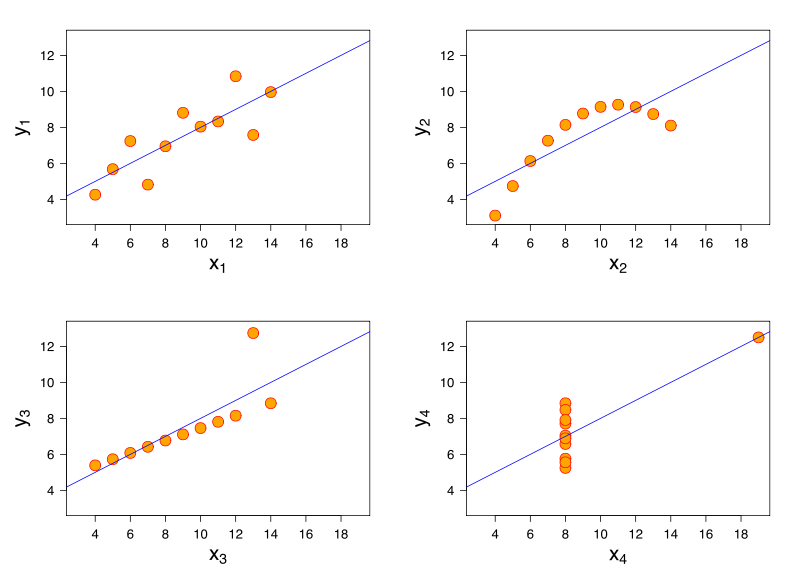
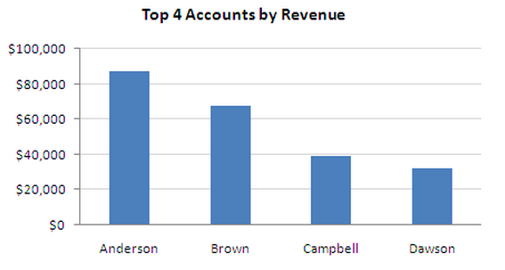
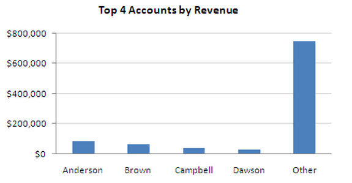
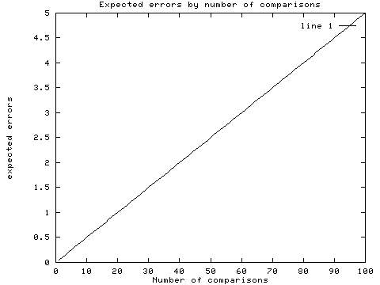

## CS595
## Machine Learning and Social Media
### **Lecture 2: Reading Research**
 
####Aron Culotta
####Assistant Professor
####Computer Science
####Illinois Institute of Technology

---

- Fong: "Reading a computer science research paper"
- Keshav: "How to read a paper"
- Barnes: "How to read a research paper"

---

## Fong
- **Comprehension:** What did they do?
- **Evaluation:** Are the results significant? Valid?
- **Synthesis:** How would you do it differently? What should be done next?

Matches nicely to Keshav's *Three-Pass Approach*.

---

## Pass 1: Comprehension
- What is the problem?
- How is it solved?
- How do we know that it was solved?
- What can we do now that we couldn't before?

---

## Pass 2: Evaluation
- Is the problem significant?
- Are contributions significant?
- Are the claims valid?
  - Do the figures and tables make sense?
  - Are the assumptions reasonable?
- What are the limitations of the approach?

---

## Pass 3: Synthesis
- *Virtually reimplement*
- How could experiments be improved?
- What other experiments could/should be run?
- How else could you apply this?
- What are unsolved problems?
- What are implicit assumptions?
- What are missing citations?

---

## Highlights
  - "Learn to be fair." Don't be superficially critical.
  - Read up to the introduction, then ask yourself: "How would I solve this?"
  - Pick points of *disagreement*.
  - Phrases like "I would have liked to seen..." are not helpful

---

## Discussion Questions
- Barnes: "You need not read a research paper sequentially from beginning to end."

---

## Discussion Questions
- How long should it take to read an 8-page paper?

---

## Discussion Questions
- How do **you** read research papers?

---

## Sample Peer Review Form

SIGNIFICANCE:

- Is the work reported important?
- Does it advance the state of the art?
- Does the paper stimulate discussion of important issues or alternative points of view?

---

## Sample Peer Review Form

TECHNICAL QUALITY:

- Is the paper technically sound?
- Does it carefully evaluate the strengths and limitations of its contributions?
- Are its claims backed up?
- Does the paper offer a new form of evidence in support of or against a well-known technique?
- Does the paper back up a theoretical idea already in the literature with experimental evidence?
- Does it offer a theoretical analysis of prior experimental results?

---

## Sample Peer Review Form

PRESENTATION:

- Is the paper clearly written?
- Does it motivate the research?
- Does it describe the inputs, outputs, and basic algorithms employed?
- Are the results described and evaluated?
- Is the paper organized in a logical fashion?
- Is the paper written in a manner that makes its content accessible to most researchers in the field?

---

## Interpreting results
### Three kinds of lies...

---

**Averages** hide information

- one foot in ice, the other in boiling water

---

[Anscombe's quartet](http://en.wikipedia.org/wiki/Anscombe's_quartet)

---

## [Long Tails](http://en.wikipedia.org/wiki/The_Long_Tail)

[source](http://blog.asmartbear.com/data-interpretation-mistakes.html)

---

## [Long Tails](http://en.wikipedia.org/wiki/The_Long_Tail)

[source](http://blog.asmartbear.com/data-interpretation-mistakes.html)

---

Statistical significance

- Choosing the right test (see [here](http://bama.ua.edu/~jleeper/627/choosestat.html) and [here](http://www.csulb.edu/~msaintg/ppa696/696stsig.htm))
- Don't forget to say what test was used!

---

statistically significant $\ne$ important

- Eating apples extends life by a statistically significant two days

---

Multiple Comparisons

---

correlation $\ne$ causation

[source](http://xkcd.com/)

---

Over-generalization

- It worked for my data, so it will work for yours, too.

--

---

## Doing a Literature Review
- **The easy way:** Find a survey paper!
  - google: "sentiment classification" survey
- Discovering synonyms / jargon
- Once you have a few key papers:
  - Find backward / forward links
  - Categorize
- Find top people and conferences

---

## Tools
- Google Scholar
- Zotero
- BibTeX
- CiteULike